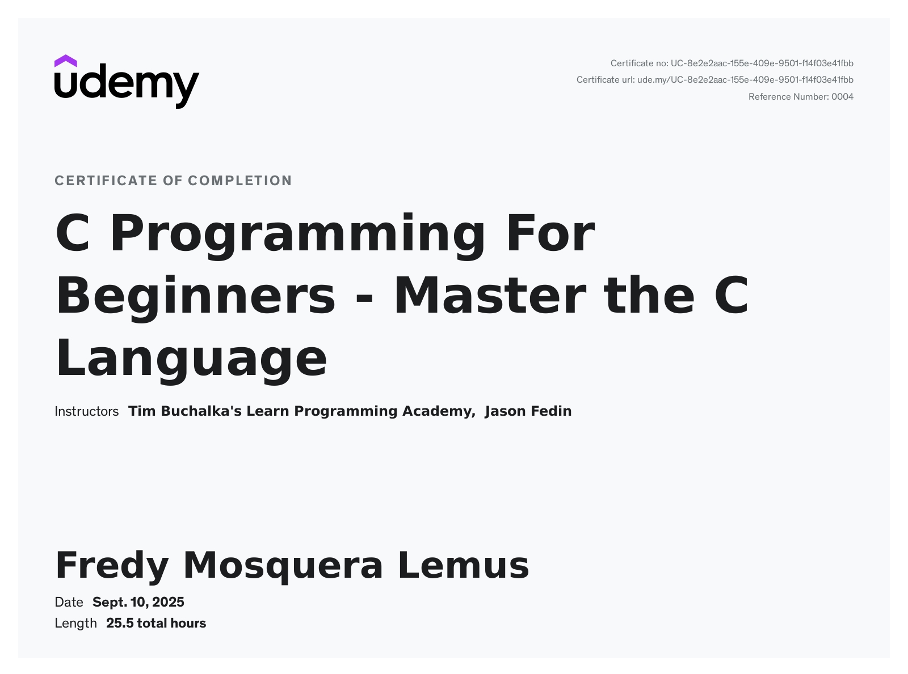

# C Programming Challenges and Assignments

This repository contains all code challenges and assignments completed from the Udemy course:  
**[C Programming For Beginners - Master the C Language](https://www.udemy.com/course/c-programming-for-beginners-/**  
by *Jason Fedin*.  

## Repository Structure
- The code files are organized by course sections.  
- Challenges begin from **Section 5**, where the course first introduces coding exercises in the *Enum* section.  
- Each section directory contains the corresponding solutions, following the progression of the course.  

## Notes
- The solutions are written in standard C, following the style and guidelines presented in the course.  
- This repository is intended as a study reference and practice archive for learning C programming fundamentals.  

# Certificate of Completion
 - Link: https://www.udemy.com/certificate/UC-8e2e2aac-155e-409e-9501-f14f03e41fbb/
 